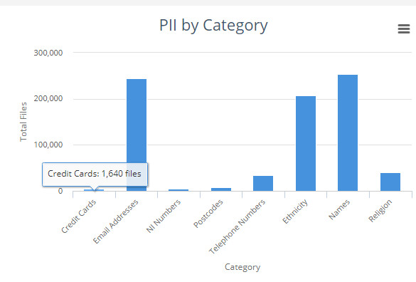
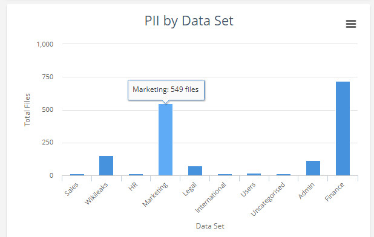
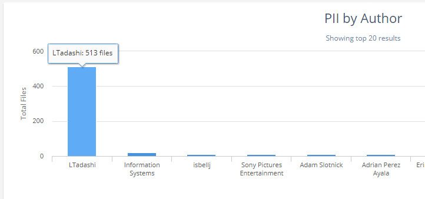
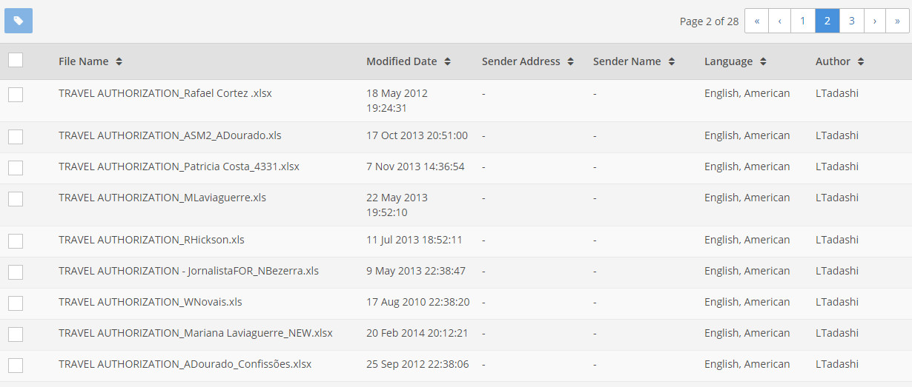
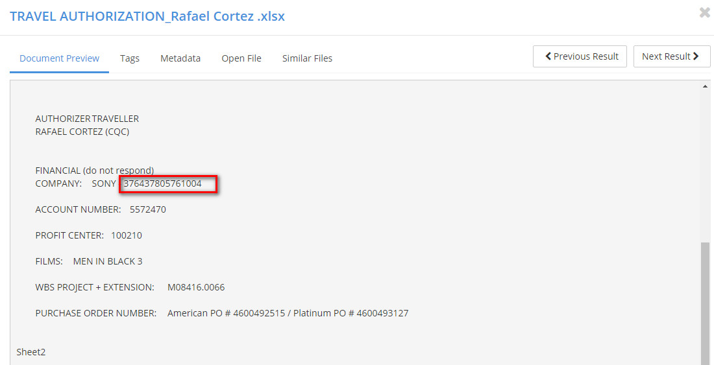

# mini GDPR report - Understanding your PII

#### Introduction
One major aspect of the product is the ability it gives an organization to understand their PII and to keep an eye on its growth. Minimising PII has data security benefits, and also shortens the response times for GDPR-related requests. There is also the added benefit of reduced storage costs.  
  
Once the data has been ingested, the platform enables an organisation to quickly determine:  
* How much PII they have.
* Where that PII is located.
* Who has access to that PII.
* The context of the documents containing the PII.  
  
Given this information, an organisation is able to assess data security, and can explore ways to try and reduce their PII. Avoiding GDPR  is not going to be possible for most companies, wherever they are in the world. But the impact can be minimised if the amount of PII can be kept under control.
 
 
 
In the context of understanding one element of PII, here's how I might use the platform to investigate the storage of credit card numbers...
 
 
#### PII by Category
1,640 credit card numbers:  

   
 
_Clicking on the "credit card" column..._  
 
 
#### PII by Data Set
A relatively large number of files (549) are in the Marketing data set:  
   
Here we might question why we have a relatively large number of credit card numbers in the Marketing data set.  
   
 
_Clicking on the "Marketing" column to drill-down futher..._  
 
 
#### PII by Author
It looks like it might be worth examining the 513 files authored by LTadashi:  
  
 
 
_Clicking on the "LTadashi" column...and then displaying the Results Pane..._  
   
 
#### Results Pane
  
There are a lot of "TRAVEL_AUTHORIZATION" files here, and they look to be related to different people, not LTadashi. Perhaps LTadashi has accessed files that he shouldn't.  
 
 
_Let's review one of these files..._    
 
 
#### Document Preview
  
Hmm, is this number what is being recognised as a credit card number? 
* We should probably download the native file and examine it to confirm. 
* If these are not credit card numbers, is there a problem with the platform? 
* Credit card numbers or not, we should probably still question why all these files, referring to different people, are all authored by LTadashi. 
* Are these files indeed related to marketing? 
* Is LTadashi definitely a member of the Marketing team and perhaps looking at files he shouldn't?
* Perhaps he is actually a member of the Finance team and this is Finance-related data? Perhaps we therefore need to tweak the grouping of our data sources into data sets?  
 
Whatever the decision regarding the author LTadashi, these files are being recognised as containing credit card numbers. Is there a way to change this?  Do we recommend that the customer review the files and redact or delete them (if they don't need to keep them) - assuming the files are not part of any current eDiscovery legal hold? 
